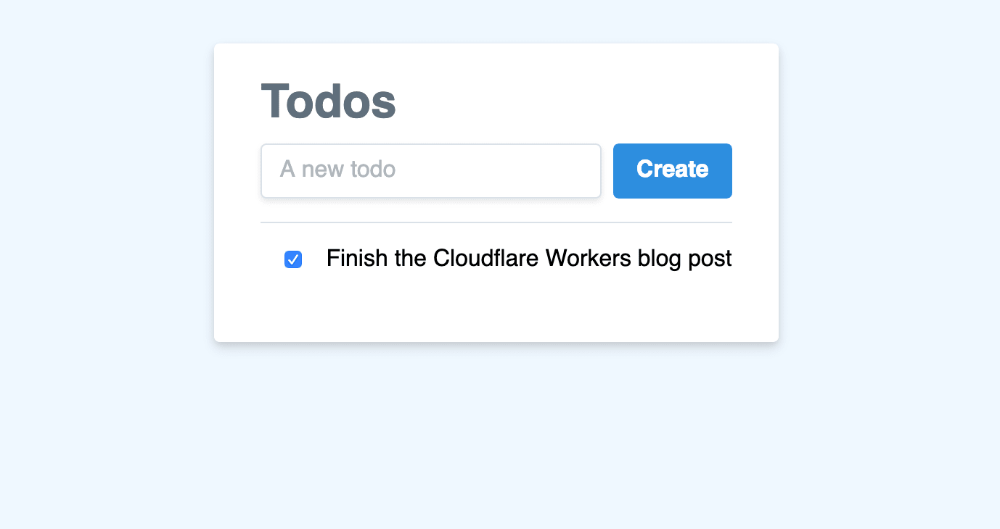

# Cloudflare Workers Todo List App

This is the source code for my Cloudflare Workers project - a simple todo application, powered by Cloudflare KV as the primary data source.

This project is served entirely from the edge, meaning that `workers/todo.js` is the primary file.

**Note that to experiment with this project, or fork it for your own usage, you'll need access to both Cloudflare Workers and Cloudflare KV.**

An example version of this project can be found at [todo.kristianfreeman.com](https://todo.kristianfreeman.com). In the blog post for this project, as well as any references to URLs below, you should assume that they are _relative_ to the base URL, `todo.kristianfreeman.com`.

## Workers

The Worker script runs at the edge of the network (Cloudflare), between the client and the origin.

### `workers/todos.js`

This script handles reading and writing todos from KV, as well as making them available in the HTML of the client.

1. Hooks into the `fetch` event on the root path to call a `handleRequest` function.
2. Looks for a GET or PUT and routes to the correct function:

#### GET requests

1. Reads from the Cloudflare KV cache to get the todo array data. The cache _key_ for this is based on the originating IP, meaning that every IP will have a different todo list.
2. If the cache key isn't found, a default empty set of todos is generated and pushed into cache.
3. Before the response is served to the user, the worker renders the text of the static HTML, and replaces `var todos;` with the actual data from the cache.
4. The static HTML is used to generate a `Response` (with a `Content-Type` header set to `text/html`) and rendered on the client.

The static HTML for this project is nested inside of the Workers script. A small script after the `body` tag takes a given `todos` data set (filled in by the Worker script) and generates a UI based on it. The UI is written in pure JavaScript, but could easily be rewritten using React or Vue.

The application allows you to view todos from the KV cache, add new todos, and update (mark as complete) existing todos. When any updates occur to the local `todos` data, the page makes a `PUT` request to `/`.

#### PUT requests

1. Reads the body of the `PUT` request, attempting to parse it as JSON to ensure that it's valid content.
2. If the content is valid, it is persisted into the Cloudflare KV store.
3. A response is constructed, returning the request body back as the response body. Because the KV cache is _eventually consistent_, we can't reliably return the data from _setting_ the cache here.
4. If anything goes wrong during this process, a new response is constructed, returning a 500 status code to the client.

## Using this project

This application is intended to be deployed in a single stage: the Workers script in `workers/` should be deployed to Cloudflare Workers, and configured in the following format:

- `workers/todos.js` should be matched with your _root_ path: for instance, `todo.kristianfreeman.com`.

You should also set up a Cloudflare KV namespace for your project, [using the Cloudflare API](https://developers.cloudflare.com/workers/kv/writing-data/). In this example, I use `KRISTIAN_TODOS`, but you can obviously call it whatever fits your version of the project. In particular, make sure that you do a find-and-replace for `KRISTIAN_TODOS`, and _also_ find out your namespace ID. The documentation linked above will instruct you on how to do that.

In addition, you need access to a few API keys and values for use inside of `workers/todos.js`:

- Account ID, available in the Worker editor URL (see [these docs again](https://developers.cloudflare.com/workers/kv/writing-data/) for instructions)
- KV namespace ID, as mentioned above
- Your Cloudflare email address
- Your Cloudflare API key, available on [your Profile page](https://dash.cloudflare.com/profile)
